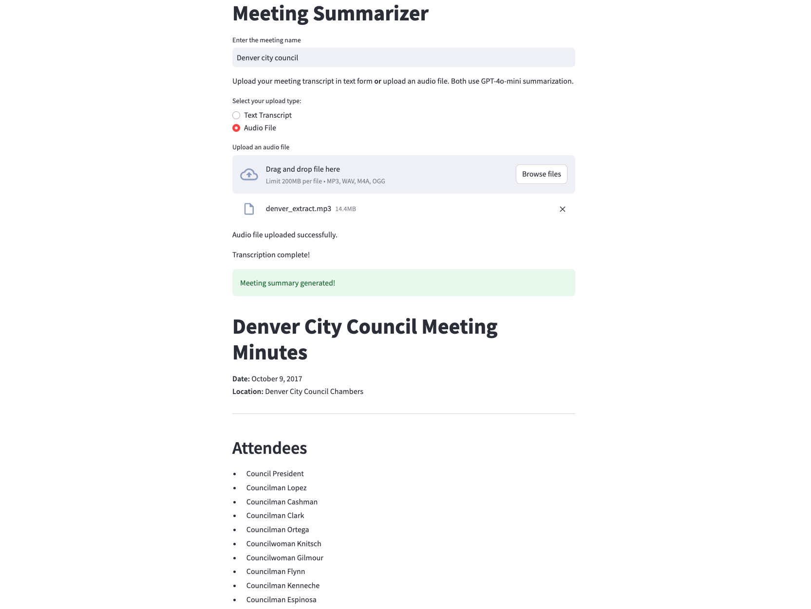
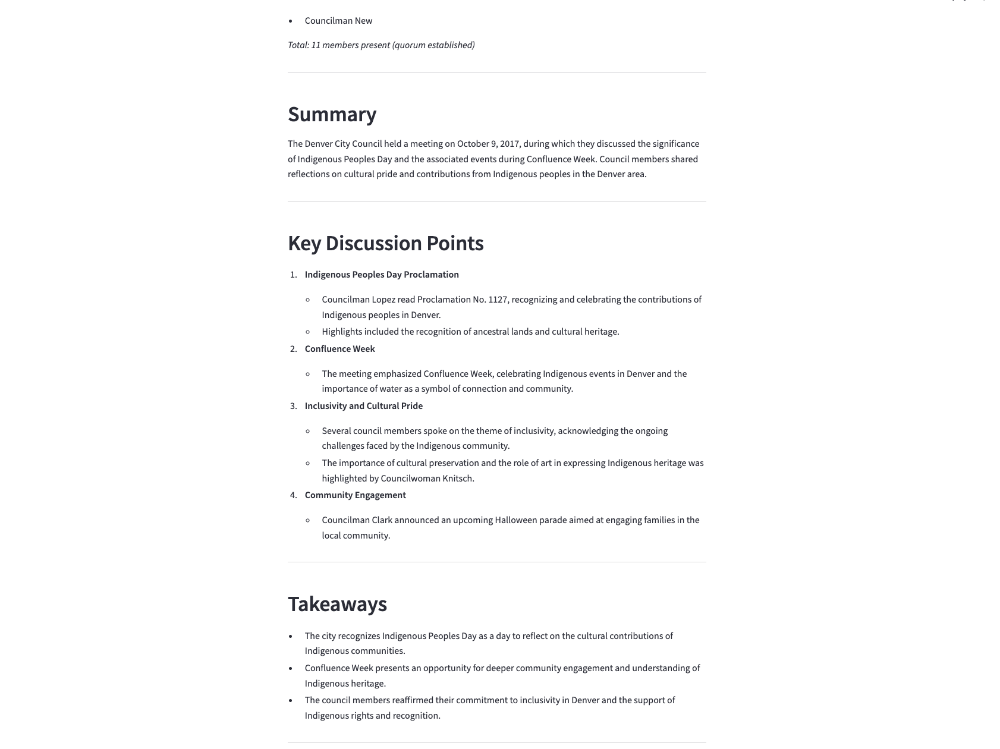
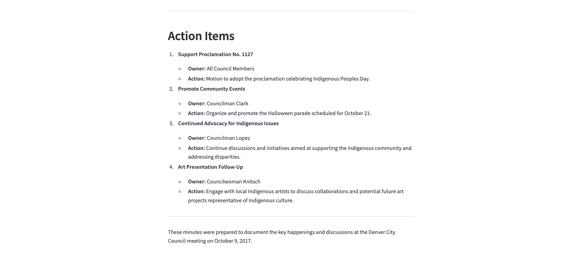

# Meeting Summarizer 📝

A Streamlit-based web application that generates concise summaries from meeting transcripts using OpenAI's **GPT-4o-mini** model. The app supports both text transcripts and audio files (transcribed via Whisper) and allows you to specify a custom meeting name.

## Features 🚀
- **Upload TXT transcripts** **or** **audio files**.
- Whisper-based transcription for audio files.
- **Custom meeting name** via a text box.
- Summaries include **key discussion points**, **takeaways**, and **action items** in Markdown format.
- **OpenAI API key validation** (`sk-proj-...`) for security.
- Clean, user-friendly **Streamlit** interface.

## Prerequisites ⚙️
- Python 3.x
- OpenAI API key (starts with `sk-proj-`)

## Installation 📦
1. Clone the repository:
   ```bash
   git clone https://github.com/alejandroarguello/meeting_summarizer.git
   cd meeting_summarizer

2. Install dependencies:
   ```
   pip install -r requirements.txt

3. Create a .env file in the root directory:
   ```bash
   OPENAI_API_KEY=sk-proj-your-key-here

## Usage ▶️
1. Run the app explicitly using the Python interpreter from your active conda environment:
   ```
   python -m streamlit run app.py

2. In the web interface:
	•	Enter the meeting name (e.g., “Weekly Marketing Sync”).
	•	Choose Text Transcript or Audio File.
	•	Upload either:
      •	A .txt transcript, or
      •	An audio file (.mp3, .wav, .m4a, .ogg).
	•	Click Generate Summary.

3. View the generated summary in Markdown format.

## Example 🎯
In the transcripts folder you have a file named 'sample_transcript.txt', upload it and set the meeting name to “Product Roadmap Review” to see the summarized result. You also have an example audio meeting named 'denver_extract.mp3' to try the Whisper transcribing capabilities.

## Configuration 🔧

| File      | Purpose |
| ----------- | ----------- |
| app.py      | Main application logic       |
| .env   | Stores OpenAI API key        |
| requirements.txt   | Lists Python dependencies        |


## Troubleshooting ❌

❌ **"API key invalid"** &rarr; Ensure your key starts with 'sk-proj-' and has no whitespace.

❌ **File upload errors** &rarr; Verify the TXT file is properly formatted.

❌ **Audio transcription issues** &rarr; Make sure the uploaded file is a valid .mp3, .wav, .m4a, or .ogg. Large files may take longer.

❌ **Meeting name not showing up properly** &rarr; Double-check you’ve entered text in the “Enter the meeting name” field.

## Note 📌
	•	This app uses OpenAI’s GPT-4o-mini for final summarization.
	•	Audio is transcribed via OpenAI Whisper.
	•	The app works with general meeting transcripts in .txt format.
	•	Meeting name input personalizes the summary to reflect your actual use case (e.g. “Board Meeting,” “Team Sync,” “Denver council,” etc.).


# Interface example 🖼️



